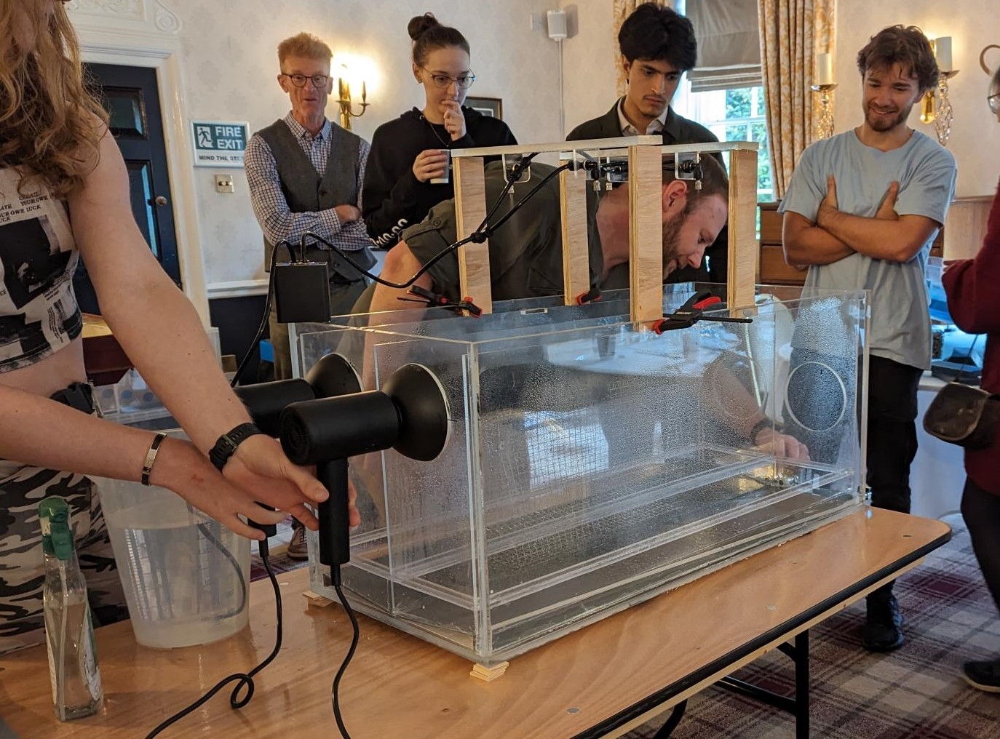
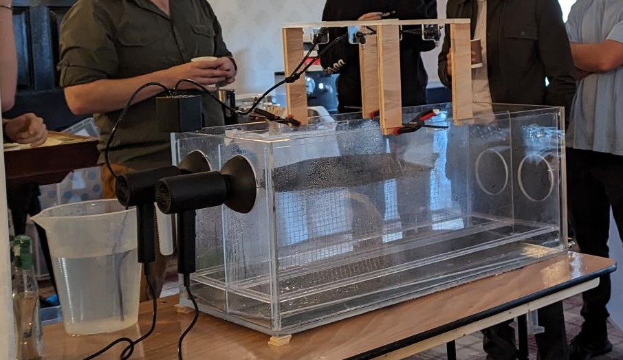

# Wet Canopy Evaporation outreach experiment

The Wet Canopy Evaporation Tank serves as a demonstration of the potential evaporative losses from tree canopies during rainfall. One side of the tank contains an aquarium filter, simulating a tree canopy. Water is consistently sprayed into both sections of the tank, with airflow provided hairdryers on either side. Over an experiment of five minutes, participants visualise the quantity of rain lost to evaporation by comparing the runoff collected in measuring cylinders from both tank compartments. Depending on environmental conditions in the demonstration room, losses are approximately 10 - 20%.

<b></b> Demonstration of the Wet Canopy Evaporation Tank at the Fluid Dynamics CDT Induction Event, Weetwood Hall, 26 September 2023.

## Component list
 - 1x Tank
 - 1x hairdryer
 - 1x Pump unit
 - 1x Inlet tubing
 - 1x Spray array (4x sprays)
 - 4x Wooden supports for sprays
 - 4x Mini clamps
 - Assorted wooden chocks for raising the tank
 - 2x Black aquarium sponge
 - 1x Chicken wire canopy support
 - 1x Extension cable
 - 2x Measuring cylinders
 - 1x Water jug
 - 1x Spray bottle
 - 1x Usbc charging cable for pump
 - 1x box of assorted spare spray heads, connectors, pipes, blu-tac etc.

Towels and cloths are also needed for drying up.

## Instructions

### Set up
- **On the day before use** charge the pump.
- Saturate the canopy sponge in a jug of water.
- Saturate the interior surfaces of both tank sides using the spray bottle.
- Position the sponge holder and sponge in one section ensuring an even canopy surface.
- Use clamps to secure wooden supports to the tank for the sprays.
- Align the sprays with the tank and canopy centre. Avoid angling the sprays towards the hairdryer inlet.
- Attach the hairdryers to the diffuser heads at the tank ends.
- Elevate the tank at the hairdryer end using wooden chocks to encourage water flow.
- Position measuring cylinders or connect tubing to the outlet for runoff collection.
- Place the pump's inlet tube into a jug of water; 3 litres per 5-minute demonstration is sufficient. Room temperature or warmer water is preferable.
- Perform a test run to verify spray alignment and check for leaks.

Perform a test run to verify spray alignment and check for leaks.

### Operation
- Ensure the tank's outlet valves are open.
- Close the wall collection valves (outer two valves).
- Turn on the spray system by holding down the on button.
- Turn on the hairdryers at maximum speed and heat.
- Monitor the volume collected in the measuring cylinders.

### Pack up
- Disconnect the hairdryers.
- Empty the wall collection valves.
- Squeeze out as much water from the canopy sponge as possible.
- Wipe the interior surfaces to dry them.
- Reverse the set-up procedure.
- Once back in the lab leave the tank uncovered to dry.

**After use, plug in the pump to charge for the next use**

### Additional notes
- Keep towels ready for any spray overspill or tap leakages.
- If sprayers malfunction replace them using the spares in the provided box. The sprays are connected to the tubing with John Guest style push-fit connectors.

## Demonstrator Experience (26 September 2023)
The tank was used during the induction event for the 2023 Fluid Dynamics CDT cohort at Weetwood Hall on 26 September 2023. The tank ran well enough for the demonstration and engagement from the cohort was good with a number of questions. Concerns regarding the volume of the unit inhibiting the explanation were alleviated but it is still best to explain the science in advance of starting the demo.

A number of improvements for this prototype and for a refined final version are listed below.

### Demonstration improvements
- **Poster**
     Enhance dissemination of the underyling science through an accompanying poster. The poster would discuss natural flood management and wet canopy evaporation's role and the measured impact in the real world.

- **Alternative canopies**
    Increase engagement by introducing canopies of varying sizes. After demonstrating the basic canopy/no-canopy comparison, participants could explore the effects of differently sized or intermittently spaced canopies.

### Prototype Tank improvements
- **Improve sealing around the inside floor of each side of tank**
    The water can collect in the space below the angled tank floor, skewing the result.

- **Test spray heads**
    Spray head performance is variable, ocassionally one doesn't mist but sprays a jet.

### Final Tank design
- **Robust support for sprays**
    The sprays are supported on wooden struts which are secured to the tank using clamps. This was necessary as there is not enough clearance to allow the spray to develop above the canopy when the spray heads are mounted at the top of the tank as originally intended. The challenge is positioning the hairdryer optimally relative to the canopy and tank floor, requiring a minimum elevation of 20 cm for unobstructed airflow. Potential solutions include a vertically collapsible lid for ease of transport, also accommodating an integrated lid as originally intended.

- **Canopy support structure**
    A robust structure for the canopy needs to be constructed. The current design uses chicken wire which can be easily modified and does not retain water but it has sharp edges and is easily damaged.

- **Aesthetics**
    The current tank does not resemble a tree canopy. Possible improvements include using short artificial grass on the base of each side of tank and 3D printed trees to place on the outside of the canopy support to disguise the frame and the black sponge.

- **Refinements**
    Increase depth of wall collection channels and size of the runoff holes. Currently, the prototype's small holes restrict water flow.
    Increase the base tilt of the tank to eliminate the need for chocks to encourage water flow.
    Modify the outlet valves or outlets to accommodate low-flow, low-volume runoff. The current design causes water to accumulate before release or requires manual intervention.

 
 ## Risk assessment
 Preliminary risk assessment is available in this folder: risk_assessment_form_WCE_March23.doc

