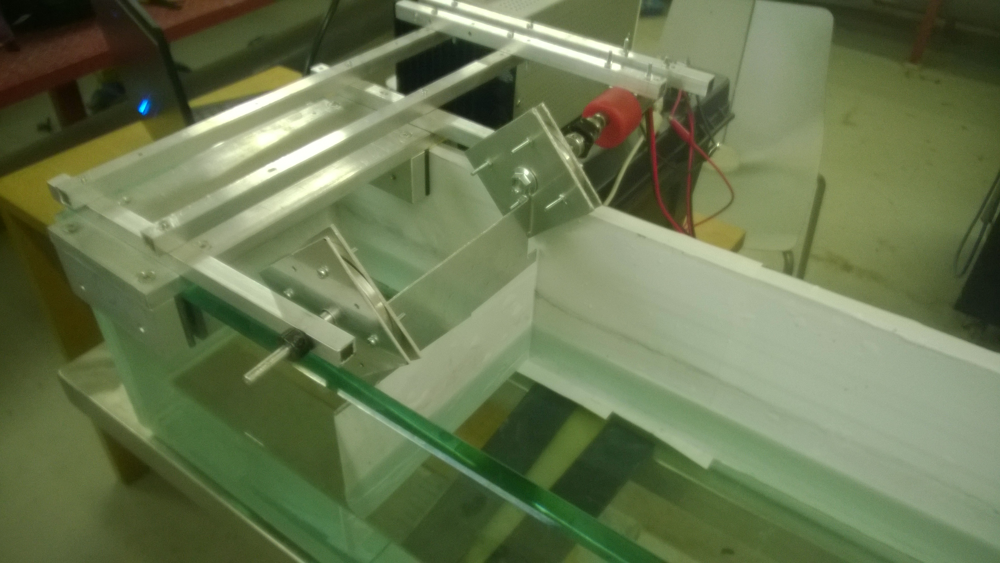
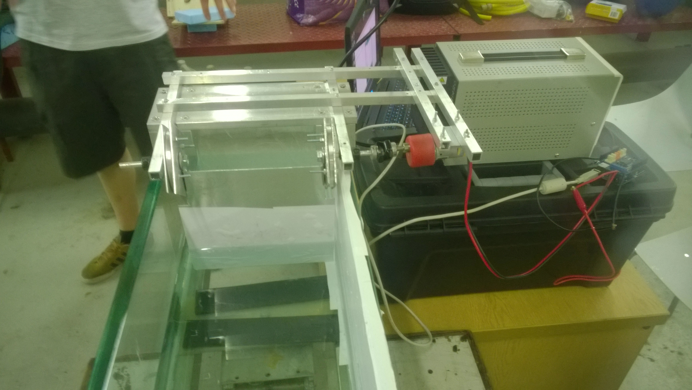
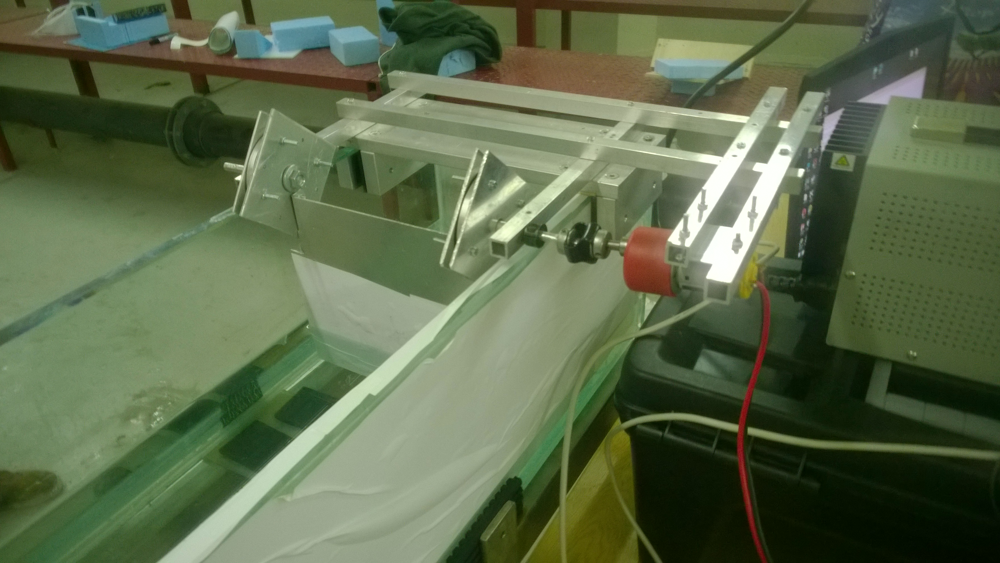
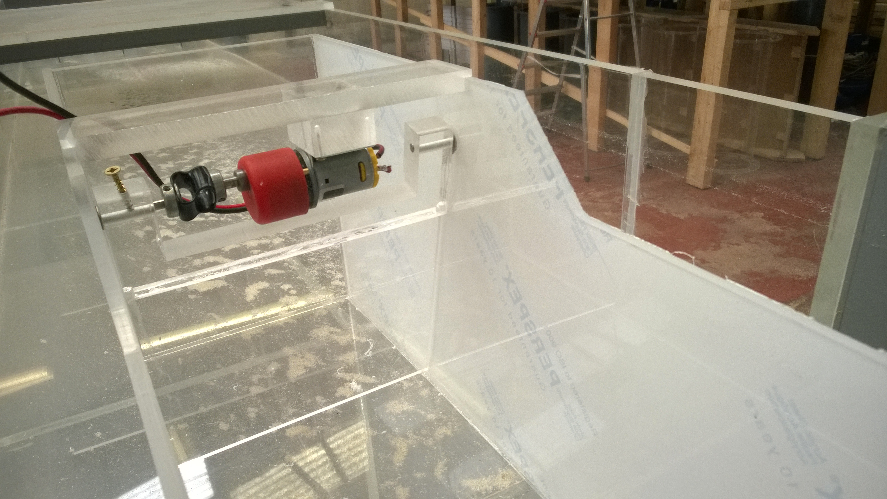
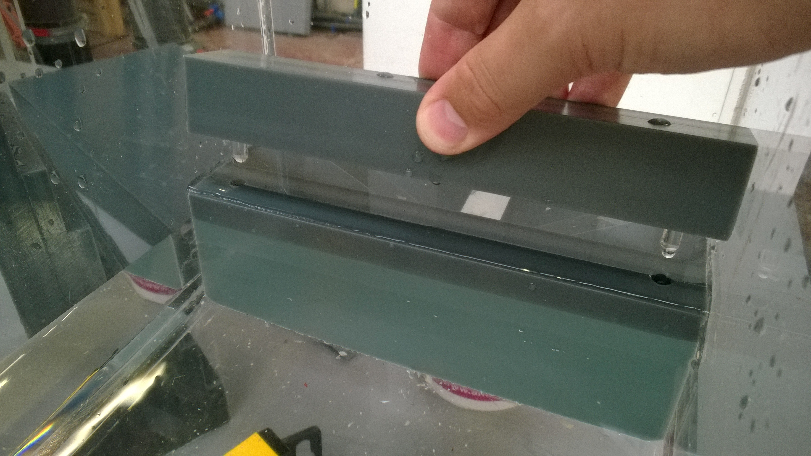
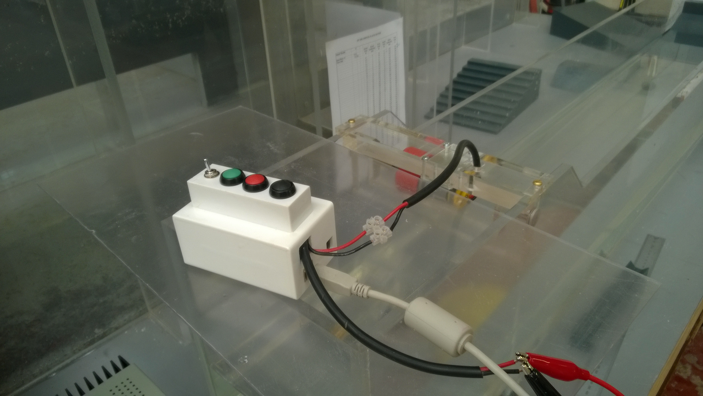

# Coastal demonstration wavetank
By Onno Bokhove using material from Will Booker, Thomas Goodfellow and Jacon von Alwo.

## History
2015 CDT project CDT students Will Booker, Thomas Goodfellow and Jacon von Alwon supervised by Duncan Borman and Onno Bokhove and commissioned by JBA Trust. Wave tank demonstration showing the impact of coastal defences on flood risk: YouTube movie has 7M hits (on 31-12-2020) https://www.youtube.com/watch?v=3yNoy4H2Z-o
Note the nice group report (Thomas GoodFellow, Will Booker and Jacob von Alwon) and two individual reports (Thomas Goodfellow and Jacob von Alwon) of 2015.

## Design instructions including Arduino
See in the appropriately named folder for extensive insr=truction by Thomas Goodfellow.

## Usage
06-03-2020 out; <used where>; XX-XX-2020 in.

## Overview via images (photos by TG)

